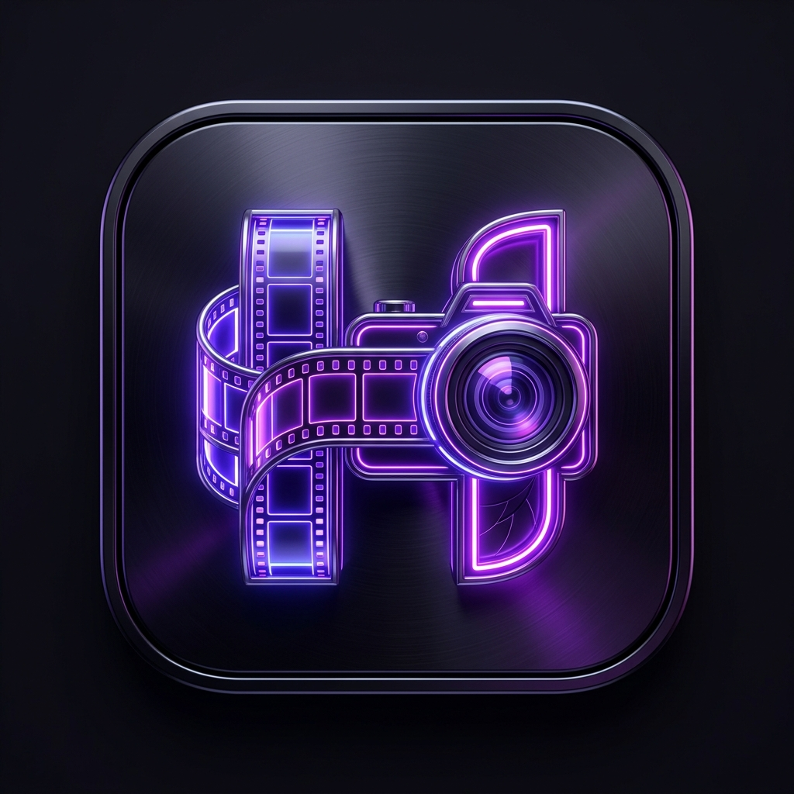
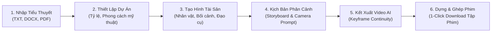

<p align="center">
  
</p>

<h1 align="center">HenryVids Studio</h1>

<p align="center">
  <strong>「 Nền tảng sản xuất phim ngắn (AI Short Drama) từ tiểu thuyết & kịch bản trọn gói 」</strong>
</p>

<p align="center">
  <i>Được phát triển và cá nhân hóa bởi <b>Henrysido (Henry)</b> &bull; Tối ưu hóa vận hành Docker 1-Click trên CachyOS / Linux & Windows</i>
</p>

<p align="center">
  
  
  
  
  
  
  
  
  
</p>

<p align="center">
  <a href="#-tổng-quan-dự-án">Tổng Quan</a> &bull;
  <a href="#-tính-năng-nổi-bật">Tính Năng Nổi Bật</a> &bull;
  <a href="#-thiết-kế--giao-diện-độc-quyền">Thiết Kế & Giao Diện</a> &bull;
  <a href="#-khởi-chạy-nhanh-1-click">Khởi Chạy 1-Click</a> &bull;
  <a href="#-quy-trình-làm-phim-từ-a-đến-z">Quy Trình Làm Phim</a> &bull;
  <a href="#-cấu-hình-mô-hình-ai">Cấu Hình AI</a> &bull;
  <a href="#-kiến-trúc--tech-stack">Kiến Trúc & Tech Stack</a> &bull;
  <a href="#-kiểm-định-chất-lượng">Kiểm Định Chất Lượng</a> &bull;
  <a href="#-bản-quyền--ghi-nhận">Bản Quyền</a>
</p>

---

## 🎬 Tổng Quan Dự Án

**HenryVids Studio** là nền tảng xưởng phim AI trọn gói, giúp bạn biến bất kỳ tác phẩm tiểu thuyết chữ, kịch bản hoặc video mẫu có sẵn thành chuỗi phim ngắn (Short Drama) hoàn chỉnh với chất lượng điện ảnh cao và tính nhất quán tuyệt đối.

Không dừng lại ở những đoạn clip rời rạc, **HenryVids Studio** tự động hóa toàn bộ dây chuyền sản xuất chuyên nghiệp:
$$\text{Tiểu thuyết / Kịch bản} \longrightarrow \text{Tách tập \& Bóc tách thực thể} \longrightarrow \text{Tạo hình nhân vật, bối cảnh \& đạo cụ} \longrightarrow \text{Biên tập kịch bản phân cảnh (Storyboard)}$$
$$\longrightarrow \text{Sinh video đa phương thức} \longrightarrow \text{Nối tiếp khung hình cuối (Keyframe Continuity)} \longrightarrow \text{Ghép phim \& Xuất bản trọn gói từng tập}$$

Toàn bộ hệ thống được Henry cá nhân hóa toàn diện về mặt nhận diện thương hiệu, thiết kế giao diện theo tông màu **Violet Cyber / Neon Purple** hiện đại, tích hợp bộ từ vựng điện ảnh chuẩn xác 100% tiếng Việt, đồng thời tích hợp sẵn công cụ xử lý media `FFmpeg` và kịch bản khởi chạy 1-click mượt mà trên Docker.

---

## 🚀 Tính Năng Nổi Bật

### 1. Hai Chế Độ Sáng Tạo Linh Hoạt
- **AI Agent Mode (Tự động hóa hoàn toàn):** Tải lên tệp tiểu thuyết (`.txt`, `.docx`, `.pdf`), Agent AI tự động phân tích cấu trúc, chia chương/tập, lập hồ sơ nhân vật và phác thảo toàn bộ kịch bản phân cảnh.
- **Manual Studio Mode (Đạo diễn chuyên nghiệp):** Toàn quyền can thiệp và kiểm soát chi tiết từng góc máy, ánh sáng, chuyển động, đạo cụ, lời thoại và thông số kết xuất video.

### 2. Xưởng Remake & Chuyển Thể Video (Remake Workshop)
- Tải lên video mẫu đơn lẻ hoặc toàn bộ thư mục video phân tập (hỗ trợ file tới 500 MB, thời lượng tới 20 phút).
- Tích hợp thư viện **PySceneDetect** phân tích ranh giới chuyển cảnh chính xác từng mili-giây.
- Tự động bóc tách nhân vật, phong cách hình ảnh và tái cấu trúc lại kịch bản phân cảnh để sản xuất phiên bản mới.
- Cơ chế Server-Sent Events (SSE) chạy ngầm độc lập; đóng trình duyệt hoặc tắt máy không làm gián đoạn tiến trình.

### 3. Giữ Vững Tính Nhất Quán Nhân Vật (Character Bible & Consistency)
- Tự động trích xuất và gom nhóm thực thể, nhận diện biệt danh / tên gọi khác nhau của cùng một nhân vật.
- Hỗ trợ **Biến thể nhân vật (Variants)**: Cùng một nhân vật nhưng có thể thay đổi trang phục, trạng thái cảm xúc, vết thương hay độ tuổi qua các phân cảnh khác nhau.
- Kho hình ảnh tham chiếu đa góc (chính diện, góc nghiêng 1, góc nghiêng 2) được tiêm tự động vào prompt kết xuất video.

### 4. Thư Viện Giọng Nói & Tính Nhất Quán Âm Thanh
- Tích hợp thư viện giọng đọc chất lượng cao và hỗ trợ tải lên âm thanh mẫu (`.mp3`, `.wav`) của riêng bạn.
- Công cụ cắt ghép âm thanh trực quan bằng thanh trượt kép (Audio Range Slider) với khả năng nghe thử tức thì.
- Cơ chế ràng buộc tự động: `@AudioN tương ứng nhân vật @{TênNhânVật}`, giúp mô hình video AI nhận diện chuẩn xác chủ nhân giọng nói mà không bị nhầm lẫn.

### 5. Nối Tiếp Khung Hình Cuối (Keyframe Continuity)
- Tự động trích xuất khung hình cuối cùng (Last Frame) của phân cảnh trước thông qua `FFmpeg` làm khung hình đầu (First Frame) cho phân cảnh tiếp theo.
- Đảm bảo video chuyển cảnh mượt mà, không bị giật lag hay thay đổi ngoại hình/bối cảnh đột ngột.
- Hỗ trợ chế độ chạy hàng loạt không cần người trực: chọn danh sách phân cảnh và hệ thống sẽ tự động thực thi tuần tự nối đuôi nhau.

### 6. Canvas Vô Cực (Infinite Workbench trên Vue Flow)
- Không gian làm việc trực quan tương tự Node-based workflow của các phần mềm làm phim chuyên nghiệp.
- Tự do sắp xếp layout, thêm node tài sản, node video, node ghi chú, node watermark, tự động dãn cách bố cục, hoàn tác/làm lại (Undo/Redo) và chia sẻ tài nguyên đồng bộ với Storyboard.

### 7. Ghép Nối & Tải Tập Phim Hoàn Chỉnh Chỉ Với 1 Cú Nhấp
- Tự động ghép nối các phân cảnh video riêng lẻ theo đúng thứ tự kịch bản thành một tập phim hoàn chỉnh.
- Hỗ trợ xem trực tuyến dòng thời gian (Timeline) và tải về video thành phẩm chất lượng cao ngay lập tức.

---

## 🎨 Thiết Kế & Giao Diện Độc Quyền

Giao diện **HenryVids Studio** được thiết kế lại hoàn toàn theo phong cách thẩm mỹ công nghệ cao:
- **Hệ màu chủ đạo**: **Violet Cyber & Neon Purple** (`#7c3aed` / `#a855f7`) mang lại cảm giác hiện đại, đậm chất studio điện ảnh tương lai.
- **Dark / Light Theme**: Tối ưu hóa sâu cho cả chế độ Sáng và Tối, bảo vệ mắt khi làm việc ban đêm và làm nổi bật màu sắc video.
- **Trang chủ Hero Portal (`HomePage.vue`)**: Trung tâm điều khiển trực quan với logo thương hiệu HenryVids, lối tắt nhanh vào Phim ngắn AI, Xưởng Remake, Dự án và Thư viện tài sản.
- **Việt hóa 100% chuyên nghiệp**: Loại bỏ hoàn toàn các từ Hán-Việt máy móc, thay bằng thuật ngữ chuẩn ngành điện ảnh (Storyboard, Keyframe Continuity, Character Bible, Phân cảnh, Dựng phim...).

---

## ⚡ Khởi Chạy Nhanh 1-Click

Ứng dụng đã được đóng gói toàn diện bằng Docker (bao gồm cả Frontend Vite, Backend FastAPI và công cụ media FFmpeg).

### Cách 1: Khởi chạy bằng Script 1-Click (Khuyến nghị cho Linux / CachyOS / WSL / macOS)

Mở terminal tại thư mục dự án và chạy:

```bash
# Khởi động ứng dụng (tự động bật Docker và mở trình duyệt)
./start.sh

# Dừng ứng dụng an toàn (toàn bộ dữ liệu được bảo lưu)
./stop.sh
```

- **Giao diện Web:** [http://localhost:8080](http://localhost:8080)
- **Tài liệu Swagger API:** [http://localhost:8080/docs](http://localhost:8080/docs)

---

### Cách 2: Triển khai bằng Docker Compose thủ công

Phù hợp cho mọi hệ điều hành (Windows PowerShell, Linux, macOS):

#### 1. Chuẩn bị môi trường (trên CachyOS / Arch Linux):
```bash
# Cài đặt Docker & Docker Compose nếu chưa có
sudo pacman -S docker docker-compose

# Kích hoạt dịch vụ Docker
sudo systemctl enable --now docker

# Cấp quyền cho user hiện tại (chạy không cần sudo)
sudo usermod -aG docker $USER
newgrp docker
```

#### 2. Clone mã nguồn và khởi chạy:
```bash
# Clone repository của Henrysido
git clone https://github.com/Henrysido/novelvidsvn.git
cd novelvidsvn

# Tạo tệp biến môi trường từ mẫu
cp .env.example .env

# Khởi động dịch vụ (tự động build Backend và Frontend)
docker compose up -d --build
```

#### 3. Quản lý container:
```bash
# Xem log hệ thống thời gian thực
docker compose logs -f

# Dừng hệ thống
docker compose down

# Cập nhật phiên bản mới nhất và build lại
git pull origin main
docker compose up -d --build
```

> **Lưu ý về dữ liệu:** Toàn bộ cơ sở dữ liệu SQLite được lưu trữ tại thư mục `./data` và toàn bộ tệp media (ảnh, video, âm thanh) được lưu tại thư mục `./media`. Dữ liệu được ánh xạ trực tiếp trên ổ cứng máy tính của bạn và **không bao giờ bị mất** khi tắt hoặc khởi động lại container.

---

### Cách 3: Chạy Phát Triển Cục Bộ (Local Development)

Dành cho nhà phát triển muốn can thiệp trực tiếp vào mã nguồn:

#### Backend (Python 3.12 + FastAPI + uv):
```bash
# Cài đặt trình quản lý uv siêu tốc
curl -LsSf https://astral.sh/uv/install.sh | sh

# Đồng bộ thư viện phụ thuộc
uv sync --dev

# Khởi chạy máy chủ Backend (cổng 9000)
make dev PORT=9000
```

#### Frontend (Vue 3 + TypeScript + Vite):
```bash
cd web

# Cài đặt thư viện phụ thuộc
npm ci

# Khởi chạy Vite dev server (cổng 3000, tự proxy /api sang backend:9000)
npm run dev
```

Truy cập giao diện dev tại: [http://localhost:3000](http://localhost:3000).

---

## 📖 Quy Trình Làm Phim Từ A Đến Z

Quy trình 6 bước tiêu chuẩn trong **HenryVids Studio**:



1. **Bước 1 - Khởi tạo dự án:** Chọn chế độ *Agent tự động* hoặc *Biên tập thủ công*. Tải lên văn bản tiểu thuyết hoặc dán trực tiếp.
2. **Bước 2 - Định hình phong cách:** Chọn tỷ lệ khung hình (16:9 ngang hoặc 9:16 dọc cho TikTok/Reels) và phong cách đồ họa (Chân thực điện ảnh, 3D Cổ phong, Tiên hiệp, Anime, Webtoon...).
3. **Bước 3 - Hồ sơ nhân vật (Character Bible):** AI trích xuất các nhân vật chủ chốt, sinh ảnh chân dung đa góc và gán giọng đọc phù hợp cho từng nhân vật.
4. **Bước 4 - Kịch bản phân cảnh (Storyboard):** Kiểm tra từng shot quay, điều chỉnh góc máy, thời lượng và liên kết thẻ tài sản `@TênNhânVật`.
5. **Bước 5 - Kết xuất video hàng loạt:** Chọn mô hình video (Seedance, MiniMax, Wan3), bật tính năng *Nối tiếp khung hình cuối* để hệ thống tự động sinh nối tiếp không cần người trực.
6. **Bước 6 - Hợp thành tập phim:** Xem lại các phân cảnh trên timeline, chỉnh sửa nếu cần và nhấp **"Ghép & Tải tập phim"** để nhận video thành phẩm hoàn chỉnh.

---

## 🤖 Cấu Hình Mô Hình AI

Toàn bộ cấu hình được quản lý trực tiếp trên Web UI tại trang **「Cài đặt / Cấu hình mô hình」** (`/settings`), lưu trữ an toàn trong cơ sở dữ liệu và không bao giờ nhúng cứng vào code.

### 1. Mô Hình Ngôn Ngữ Lớn (LLM)
Hỗ trợ giao thức **OpenAI-compatible**, dễ dàng kết nối tới:
- **OpenAI:** GPT-4o, GPT-4o-mini
- **DeepSeek:** DeepSeek-V3, DeepSeek-R1
- **Doubao (Volcengine Ark):** Doubao-pro-32k / 128k (hỗ trợ cờ Thinking Mode)
- **Qwen / Moonshot Kimi / Claude** (qua proxy OpenAI-compatible)

### 2. Mô Hình Sinh Ảnh (Image Generation)
- **ByteDance Doubao Seedream 5.0 Lite / Pro:** Chất lượng hình ảnh cực cao, hỗ trợ độ nét 1.5K / 2K, tỷ lệ linh hoạt.
- **OpenAI GPT Image 2:** Hỗ trợ sinh ảnh theo prompt chi tiết.

### 3. Mô Hình Sinh Video (Video Generation)
- **Doubao Seedance 2.0 / Fast / Mini:** Hỗ trợ ảnh/video/âm thanh tham chiếu, nối khung hình đầu-cuối, âm thanh đồng bộ, thời lượng tối đa 15s.
- **Doubao Seedance 2.5:** Đa dạng vật liệu tham chiếu hơn, thời lượng cảnh quay tối đa 30s.
- **MiniMax H3:** Độ phân giải 768P / 2K, hỗ trợ khung hình đầu-cuối và sinh video điện ảnh mượt mà.
- **Aliyun Wan3.0 (DashScope):** Hỗ trợ Text-to-Video, Image-to-Video, video tham chiếu toàn diện (All-Round).

---

## 🏗️ Kiến Trúc & Tech Stack

```
novelvidsvn/
├── api/                    # Tầng RESTful API endpoints (/api)
├── controllers/            # Tầng điều phối nghiệp vụ
├── models/                 # Tortoise ORM models (SQLite / PostgreSQL)
├── schemas/                # Pydantic v2 schemas xác thực dữ liệu
├── services/               # Dịch vụ lõi (AI Tasks, Storyboard, Remake, Video Factory, OSS)
├── prompts/                # Mẫu Prompt AI tối ưu hóa theo ngành
├── test/                   # Bộ kiểm thử Backend (Pytest)
├── web/                    # Ứng dụng Frontend (Vue 3 + TypeScript + Vite)
│   ├── src/
│   │   ├── pages/          # Các trang giao diện (Home, Storyboard, Remake, Billing, Settings...)
│   │   ├── features/       # Không gian Canvas vô cực (Workbench Flow)
│   │   ├── components/     # Các component UI tái sử dụng
│   │   ├── locales/        # Từ điển đa ngôn ngữ (Tiếng Việt vi-VN, Tiếng Trung zh-CN)
│   │   ├── app-theme.css   # Hệ thống biến giao diện Violet Cyber độc quyền
│   │   └── api.ts          # Client API & cơ chế xác thực
│   └── public/             # Logo, Favicon và hình nền thương hiệu HenryVids
├── Dockerfile              # Dockerfile đóng gói Backend kèm FFmpeg
├── docker-compose.yml      # Cấu hình triển khai container trọn gói
├── start.sh                # Kịch bản 1-click khởi chạy ứng dụng
├── stop.sh                 # Kịch bản 1-click dừng ứng dụng an toàn
├── CHAY_UNG_DUNG.md        # Hướng dẫn sử dụng nhanh tiếng Việt
└── README.md               # Tài liệu tổng quan chính thức của HenryVids Studio
```

### Công Nghệ Nền Tảng
- **Backend:** Python 3.12, FastAPI, Tortoise ORM, Pydantic v2, PySceneDetect, FFmpeg, Uvicorn, uv.
- **Frontend:** Vue 3 (Composition API), TypeScript, Vite, Pinia, Vue Flow, Vue Router, vue-i18n, Lucide Icons.
- **Triển khai:** Docker, Docker Compose, Nginx (Frontend static server).

---

## 🧪 Kiểm Định Chất Lượng (Testing)

Mã nguồn được kiểm định nghiêm ngặt với độ bao phủ cao:

```bash
# Kiểm thử đơn vị & tích hợp Frontend (Vitest)
cd web && npm run test
# Kết quả: 137 test suites passed (137/137) | 451 tests passed (451/451)

# Kiểm tra an toàn kiểu dữ liệu TypeScript & đóng gói production
cd web && npm run build
# Kết quả: vue-tsc -b sạch lỗi, Vite build hoàn tất trong ~1.4s

# Kiểm thử Backend (Pytest)
uv run pytest
```

---

## 📜 Bản Quyền & Ghi Nhận (License & Credits)

- Dự án được phát triển, tối ưu hóa vận hành và cá nhân hóa thương hiệu bởi **[Henrysido (Henry)](https://github.com/Henrysido/novelvidsvn)**.
- Kế thừa và phát triển từ mã nguồn mở nền tảng của tác giả **Anning** (`Anning01/novelvids`).
- Phát hành theo giấy phép **[Creative Commons Attribution-NonCommercial 4.0 International (CC BY-NC 4.0)](LICENSE)**.
  - ✅ **Sử dụng cá nhân, học tập, nghiên cứu và sáng tạo nội dung**: Hoàn toàn tự do và miễn phí.
  - ❌ **Sử dụng thương mại trực tiếp**: Nghiêm cấm bán lại mã nguồn hoặc đóng gói thành dịch vụ thương mại có thu phí khi chưa có văn bản thỏa thuận.

---

<p align="center">
  <sub>HenryVids Studio &bull; Crafting Stories into Cinema with AI &bull; 2026</sub>
</p>
